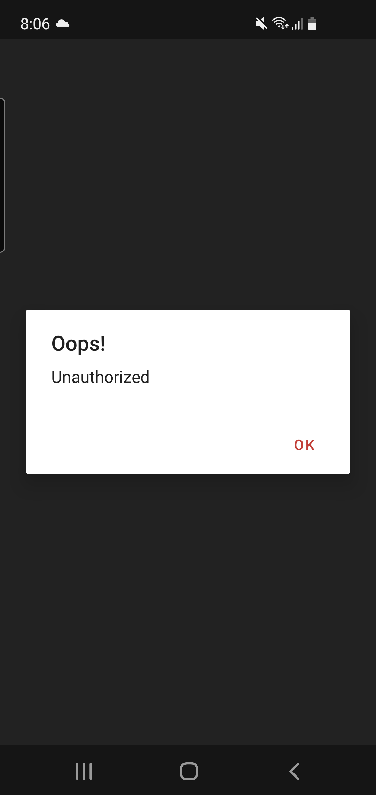

# Marvel Madness  
  


### Simple example app that utilizes the Marvel application programming interface (API)  

   

<br/><br/>

### Use the instructions below to clone and run the app locally
  
  
- Be sure that you have signed up for an account at ```developer.marvel.com``` and have access to your  public key and private key from the developer console. Keep the private key in a safe place and DO NOT  make reference to it's value in the app  
  
- Clone the repo to your local environment

- While in the project root directory, create a file called ```.secrets```. This file has been added to the .gitignore,  so you'll need to create it in order for your local environment to build the app correctly. You should NEVER include this file in a git commit  
  
- Edit the ```.secrets``` file and add the following values  
  
```properties  
apikey="<PUBLIC_KEY>"  
hash="<MD5_HASH>"  
```  
  
The MD5 hash can be calculated using the following:  
  
```properties  
MD5("1<PRIVATE_KEY><PUBLIC_KEY>")  
```  
  
There is also a helper script called ```secret_creator.sh``` that will help you create the ```.secrets``` file. Just run  ```sh secret_creator.sh``` from terminal and the script will ask you for your public key and then your hash and then the file will be created.
  
- Don't forget to re-sync gradle!  

- The app should be ready to build and run!

- You will see the following error dialogs when you have entered client secrets that are blank (image #1) or incorrect (image #2) <br/>
  
<br/>


---

#### Third party libraries	

This app uses the following third party libraries
<b>
- org.jetbrains.kotlin:kotlin-stdlib:1.4.31
- androidx.core:core-ktx:1.6.0
- androidx.appcompat:appcompat:1.3.0
- androidx.constraintlayout:constraintlayout:2.0.4
- androidx.lifecycle:lifecycle-extensions:2.2.0
- com.google.android.material:material:1.4.0'
- io.reactivex.rxjava2:rxjava:2.2.10
- io.reactivex.rxjava2:rxkotlin:2.0.0 
- com.squareup.retrofit2:converter-gson:2.4.0
- com.squareup.retrofit2:retrofit:2.4.0
- okhttp3:okhttp:3.12.1
- com.squareup.picasso:picasso:2.71828

<br>

- junit:junit:4.13.2'
- org.jetbrains.kotlin:kotlin-test-junit:1.3.61
- org.robolectric:robolectric:4.3.1

- androidx.annotation:annotation:1.2.0
- androidx.test: runner:1.4.0
- androidx.test:rules:1.4.0
- androidx.test.espresso:espresso-core:3.4.0
- androidx.test.espresso:espresso-contrib:3.4.0
- androidx.test.espresso:espresso-intents:3.4.0
</b>
<br/>

---

#### App Notes

- Thumbnails
	- Some of the thumbnails appear to be missing or unavailable, so the app attempts to find an alternate photo from the ```images``` array that is returned from the server. Not 100% sure this is what these images are for, but some image is better than no image! :)

	- I didn't really like the default 'image not found' image that gets returned from the api,  so in the event that the app cannot find a suitable image, it will display an alternate image that prominently displays the 'Marvel' logo 
	<br>
	<div style="display: inline-block">
		
		
	</div>
	<br><br>

	- The use of the alternate thumbnail can be changed by editing the BuildConfig value ```USE_PRETTY_THUMBNAIL```. The default value is 'false'.

	- The alternate image is only used for comic books and not for characters. Missing character images will still display the default image returned by the server
<br>

- Comic Information
	- The comic information page displays the following values when a comic is selected <b>
		- Title
		- Issue number
		- Creators
		- Thumbnail
		- Description
		- Characters
			- This section will be hidden if no characters were returned from the server
	</b>
